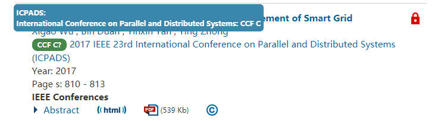
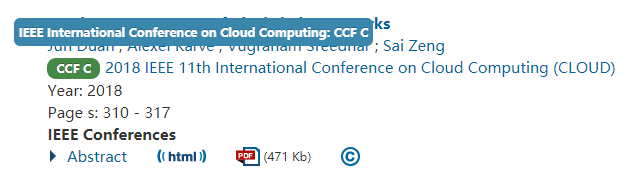
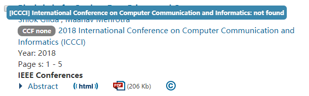

# show-rank
Extension for Google Chrome to show conference/journal rankings in search results. Currently supports CCF(China Computer Federation) rankings on [IEEExplore](https://ieeexplore.ieee.org), [ACM Digital Library](https://dl.acm.org/) and [DBLP](https://dblp.uni-trier.de/).

一个 Google Chrome 扩展，用于在论文搜索结果页面显示会议/期刊等级。目前支持在  [IEEExplore](https://ieeexplore.ieee.org), [ACM Digital Library](https://dl.acm.org/) 和 [DBLP](https://dblp.uni-trier.de/)上显示 CCF （中国计算机协会）等级。

## Intstall

Install from Chrome Webstore / 从 Chrome 网上应用店上安装：

[https://chrome.google.com/webstore/detail/show-conferencejournal-ra/hcfmpekcjhpfcokagmhnhldpacknikim](https://chrome.google.com/webstore/detail/show-conferencejournal-ra/hcfmpekcjhpfcokagmhnhldpacknikim)

Direct download / 直接下载：

[https://github.com/hnshhslsh/show-rank/releases/download/v1.3.0/show-rank-v1.3.0.crx](https://github.com/hnshhslsh/show-rank/releases/download/v1.3.0/show-rank-v1.3.0.crx)

## Introduction

When searching for papers on [IEEExplore](https://ieeexplore.ieee.org), [ACM Digital Library](https://dl.acm.org/) or [DBLP](https://dblp.uni-trier.de/), the CCF rankings of conferences/journals  are automatically placed before the sources and marked with different colors.

在 [IEEExplore](https://ieeexplore.ieee.org)， [ACM Digital Library](https://dl.acm.org/) 或 [DBLP](https://dblp.uni-trier.de/) 上搜索论文时，会自动地在来源前加上会议/期刊的 CCF 等级，并以不同颜色标识。

If the abbreviation of the conference/journal can be found in the ranking database, but the full name does not match, a question mark `?`will be displayed after the ranking. When the mouse is hovering over a ranking with a question mark, the full name of the conference/journal corresponding to the abbreviation of this ranking will be displayed for inspection. 

如果会议/期刊的简称可以在等级数据库中查询到，但全称并不完全匹配，则会在等级后显示问号`?`。鼠标悬浮在带有问号的标识上时，会显示该等级的简称对应的会议/期刊全称，以供检验。

When the mouse is hovering over a ranking without a question mark, the recognized meeting/journal name will be displayed for inspection. 

鼠标悬浮在没有问号的标识上时，会显示识别到的会议/期刊名称，以供检验。

## Thanks

- [magichan](https://github.com/magichan/CCF-Recommended-Catalog-2019) for CCF Rank data / 提供CCF排名数据
- [yishanchuan](https://github.com/yishanchuan/show-rank) for adding support of DBLP and updating CCF rank to 2019 / 添加对 DBLP 网站的支持，更新 CCF 排名到2019年的版本